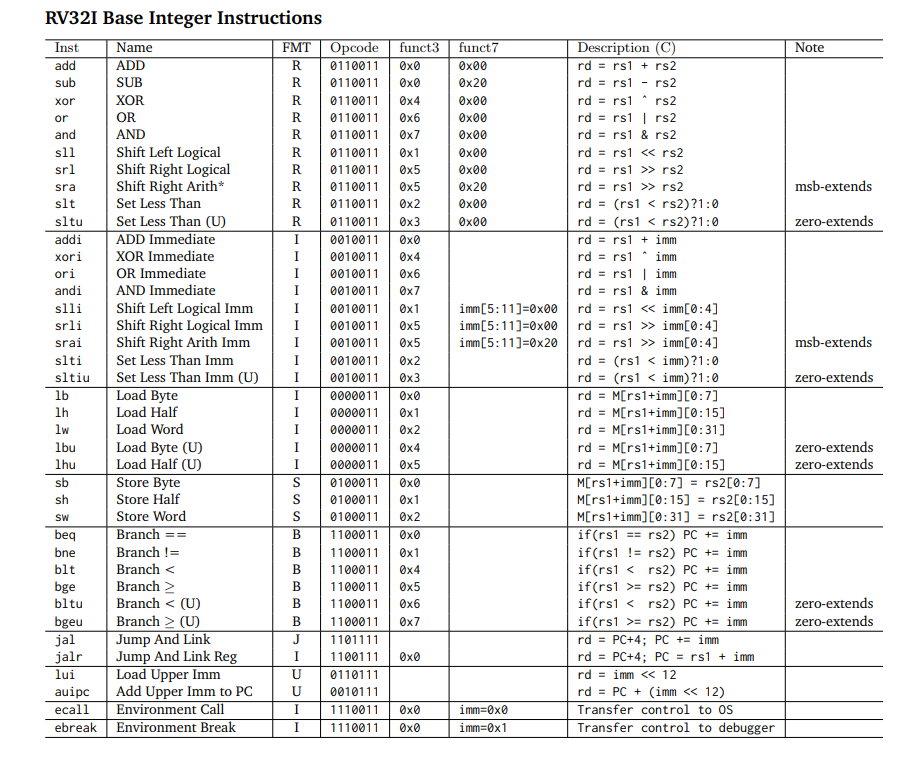
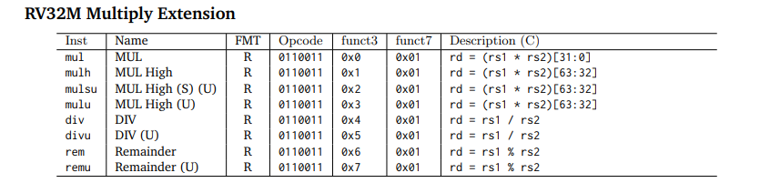
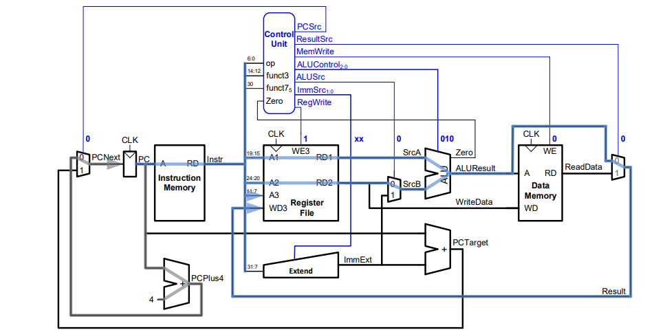
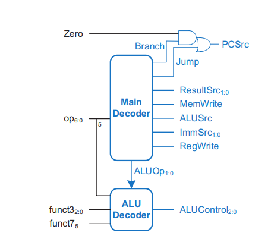
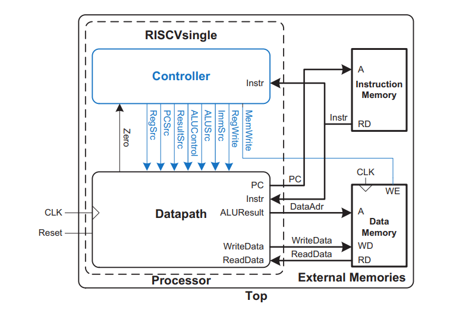

# RV32IM-RISC-V-
A 32 bit RISC V CPU which includes all standard integer type instructions along with M extension that includes multiplication and division operation.

# RV32IM RISC-V Processor

## Overview
This project implements the RV32IM RISC-V processor, which includes both the base integer instruction set (RV32I) and the multiplication/division extension (M-extension). The design is suitable for FPGA or ASIC implementation.

The processor supports:
- 32-bit base integer instructions (RV32I)
- Multiplication and division instructions (M-extension)

## Features
- **Architecture:** 32-bit RISC-V (RV32IM)
- **Extensions:** M-extension (Multiplication and Division)
- **Synthesis:** FPGA and ASIC synthesis flows

## Instruction Set Architecture (ISA)

### RV32I Instruction Set
The RV32I is the base integer instruction set for the RISC-V architecture. It includes the following types of instructions:
- **R-type:** Register-register operations
- **I-type:** Immediate value operations
- **S-type:** Store operations
- **B-type:** Conditional branches
- **U-type:** Upper immediate operations
- **J-type:** Jump instructions

Each instruction follows a fixed 32-bit format. Below is a representation of these formats:

## Block level design of the datapath of the processor

## Control unit

## Top 

## Processor Components

### Controller
The **controller** is responsible for generating control signals based on the decoded instruction. It manages the overall operation of the processor by coordinating the flow of data between different units. Key responsibilities include:
- **Instruction Decoding:** Decodes the opcode and generates the appropriate control signals for the datapath.
- **ALU Control:** Selects the correct operation (e.g., addition, subtraction, shifting) for the ALU based on the instruction type.
- **Control Signal Generation:** Produces signals to control data movement, memory access, branch decisions, and register writes.
- **Pipeline Control:** Manages stall and flush signals for pipeline hazards (e.g., branch misprediction, load-use data hazards).
- **M Extension Support:** Provides specific control signals for multiplication and division instructions as part of the M extension.

### Datapath
The **datapath** is the part of the processor that performs arithmetic operations, data transfers, and other computations. It is composed of the following main components:
- **Register File:** A set of 32 general-purpose registers used for storing intermediate values.
- **Arithmetic Logic Unit (ALU):** Performs arithmetic and logic operations (e.g., addition, subtraction, bitwise AND/OR, shifts).
- **Multiplier/Divider Unit:** Executes multiplication and division operations for the M-extension.
- **Program Counter (PC):** Holds the address of the next instruction to be executed.
- **Immediate Extension Block:** Extends immediate values (e.g., 12-bit or 20-bit immediate) from instructions to 32 bits, 
allowing them to be used in operations within the datapath.
- **Memory Access:** Supports load and store instructions to access data memory.
- **Forwarding/Bypass Logic:** Helps resolve data hazards in the pipeline by forwarding data from later stages.
- **Branch/Jump Unit:** Determines the next PC value for control flow instructions such as branches and jumps.

