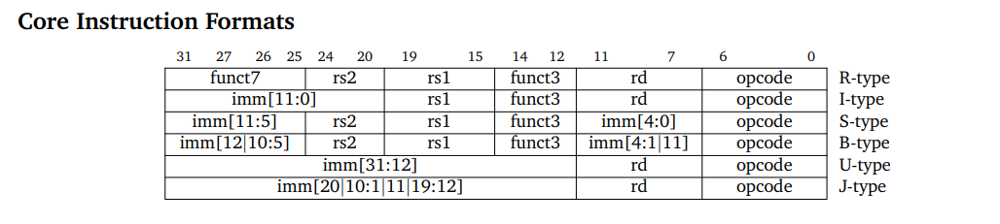

# RV32IM-RISC-V-
A 32 bit RISC V CPU which includes all standard integer type instructions along with M extension that includes multiplication and division operation.

# RV32IM RISC-V Processor

## Overview
This project implements the RV32IM RISC-V processor, which includes both the base integer instruction set (RV32I) and the multiplication/division extension (M-extension). The design is suitable for FPGA or ASIC implementation.

The processor supports:
- 32-bit base integer instructions (RV32I)
- Multiplication and division instructions (M-extension)

## Features
- **Architecture:** 32-bit RISC-V (RV32IM)
- **Extensions:** M-extension (Multiplication and Division)
- **Synthesis:** FPGA and ASIC synthesis flows

## Instruction Set Architecture (ISA)

### RV32I Instruction Set
The RV32I is the base integer instruction set for the RISC-V architecture. It includes the following types of instructions:
- **R-type:** Register-register operations
- **I-type:** Immediate value operations
- **S-type:** Store operations
- **B-type:** Conditional branches
- **U-type:** Upper immediate operations
- **J-type:** Jump instructions

Each instruction follows a fixed 32-bit format. Below is a representation of these formats:

