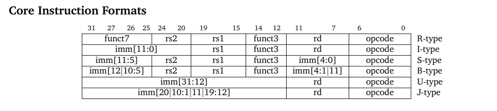
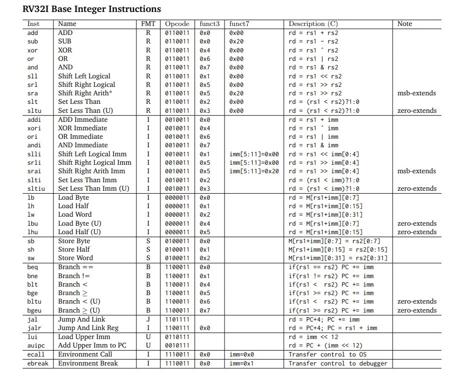
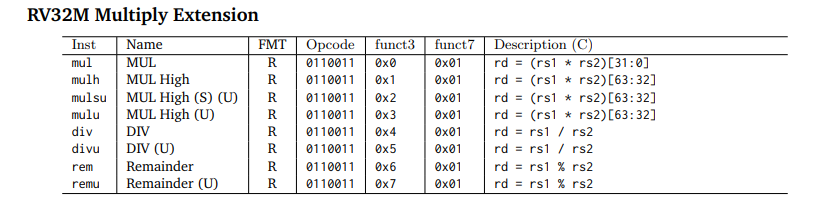
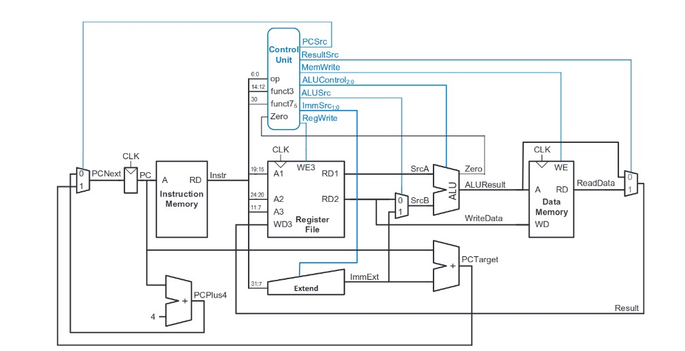
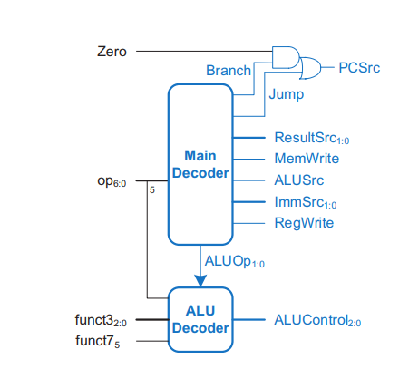
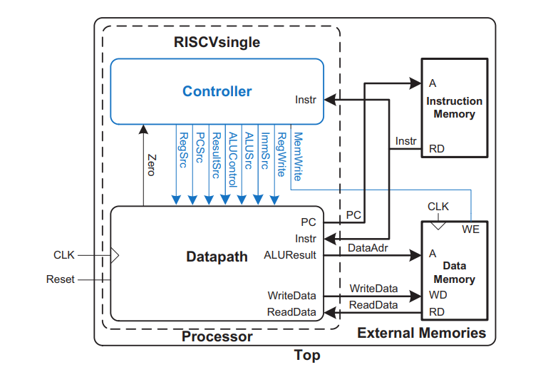
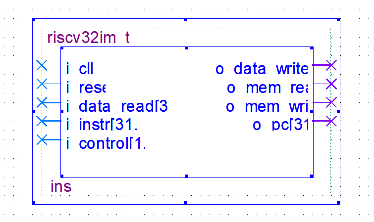

# RV32IM-RISC-V-
A 32 bit RISC V CPU which includes all standard integer type instructions along with M extension that includes multiplication and division operation.

# RV32IM RISC-V Processor

## Overview
This project implements the RV32IM RISC-V processor, which includes both the base integer instruction set (RV32I) and the multiplication/division extension (M-extension). The design is suitable for FPGA or ASIC implementation.

The processor supports:
- 32-bit base integer instructions (RV32I)
- Multiplication and division instructions (M-extension)

---

## Features
- **Architecture:** 32-bit RISC-V (RV32IM)
- **Extensions:** M-extension (Multiplication and Division)
- **Synthesis:** FPGA and ASIC synthesis flows

---

## Instruction Set Architecture (ISA)

### RV32I Instruction Set
The RV32I is the base integer instruction set for the RISC-V architecture. It includes the following types of instructions:
- **R-type:** Register-register operations
- **I-type:** Immediate value operations
- **S-type:** Store operations
- **B-type:** Conditional branches
- **U-type:** Upper immediate operations
- **J-type:** Jump instructions

Each instruction follows a fixed 32-bit format. Below is a representation of these formats:

---

## Block level design of the datapath of the processor

---

## Control unit

---

## Top 

---

## Block level I/O's 

---

# RV32IM RISC-V Processor Top-Level I/O Pin Description

## Input Pins:

1. **Clock (`i_clk`)**:
   - Provides the processor's clock signal, dictating the operating pace.

2. **Reset (`i_reset`)**:
   - Resets the processor to a known state. Typically, this is an active-low signal (`rst_n`).

3. **Data Inputs (`i_data_read`)**:
   - Input data lines for interfacing with memory, peripherals, or external devices, usually data read in load instruction.
   - Typically 32-bit wide for RV32IM.

4. **Instruction Inputs (`i_instr`)**:
   - Input bus for fetching instructions from instruction memory.
   - Width is typically 32 bits.

5. **Control Signals (`i_control`)**:
   - Control signals received typically from AHB controller or the DMA controller.

---

## Output Pins:

1. **Data Outputs (`o_data_write`)**:
   - Output data lines for sending data to memory, peripherals, or external systems, usually data written in store 
     insruction.
   - Typically 32-bit wide for RV32IM.

4. **Instruction Output (`o_pc`)**:
   - Typically sent to the AHB bus to fetch the next instruction from the instruction memory.

5. **Memory Read Enable (`o_mem_read`)**:
   - Control signal such that the processor is performing a read operation from memory or cache.

6. **Memory Write Enable (`o_mem_write`)**:
   - Control signal such that the processor is writing data to memory.

---

## Processor Components

### Controller
The **controller** is responsible for generating control signals based on the decoded instruction. It manages the overall operation of the processor by coordinating the flow of data between different units. Key responsibilities include:

- **Instruction Decoding:** Decodes the opcode and generates the appropriate control signals for the datapath.
- **ALU Control:** Selects the correct operation (e.g., addition, subtraction, shifting) for the ALU based on the instruction type.
- **Control Signal Generation:** Produces signals to control data movement, memory access, branch decisions, and register writes.
- **M Extension Support:** Provides specific control signals for multiplication and division instructions as part of the M extension.

---

### Datapath
The **datapath** is the part of the processor that performs arithmetic operations, data transfers, and other computations. It is composed of the following main components:
- **Register File:** A set of 32 general-purpose registers used for storing intermediate values.
- **Arithmetic Logic Unit (ALU):** Performs arithmetic and logic operations (e.g., addition, subtraction, bitwise AND/OR, shifts).
- **Multiplier/Divider Unit:** Executes multiplication and division operations for the M-extension.
- **Program Counter (PC):** Holds the address of the next instruction to be executed.
- **Immediate Extension Block:** Extends immediate values (e.g., 12-bit or 20-bit immediate) from instructions to 32 bits, 
allowing them to be used in operations within the datapath.
- **Memory Access:** Supports load and store instructions to access data memory.
- **Branch/Jump Unit:** Determines the next PC value for control flow instructions such as branches and jumps.

---

## Control Signals for Standard Integer Instructions

This table outlines the control signals for different types of RISC-V standard integer instructions in the RV32IM processor design.

| `op` | `Instruction` | `RegWrite` | `ImmSrc` | `ALUSrc` | `MemWrite` | `ResultSrc` | `Branch` | `ALUOp` |
|:----:|:-------------:|:----------:|:--------:|:--------:|:----------:|:-----------:|:--------:|:-------:|
| 3    | `lw`          | 1          | 00       | 1        | 0          | 1           | 0        | 00      |
| 35   | `sw`          | 0          | 01       | 1        | 1          | X           | 0        | 00      |
| 51   | `R-type`      | 1          | XX       | 0        | 0          | 0           | 0        | 10      |
| 99   | `beq`         | 0          | 10       | 0        | 0          | X           | 1        | 01      |
| 19   | `I-type`      | 1          | 00       | 1        | 0          | 0           | 0        | 10      |
| 111  | `J-type`      | 1          | 11       | 1        | 0          | 0           | 1        | 00      |
| 103  | `B-type`      | 0          | 10       | 0        | 0          | X           | 1        | 01      |

### Control Signal Definitions:
- **RegWrite:** Controls whether the register file is written (1) or not (0).
- **ImmSrc:** Determines the source of the immediate value:
  - 00: Load/store instructions
  - 01: Store instructions (e.g., `sw`)
  - 10: Branch instructions (e.g., `beq`)
  - 11: Jump instructions (e.g., `jal`)
- **ALUSrc:** Selects whether the second ALU operand is a register (0) or an immediate value (1).
- **MemWrite:** Controls whether memory is written (1) or not (0).
- **ResultSrc:** Determines the source of the value to write back to the register file (e.g., 1 for memory load, 0 for ALU result).
- **Branch:** Indicates whether the instruction is a branch or jump (1) or not (0).
- **ALUOp:** Specifies the operation performed by the ALU (e.g., 00 for addition, 01 for subtraction, 10 for logic operations).

---

